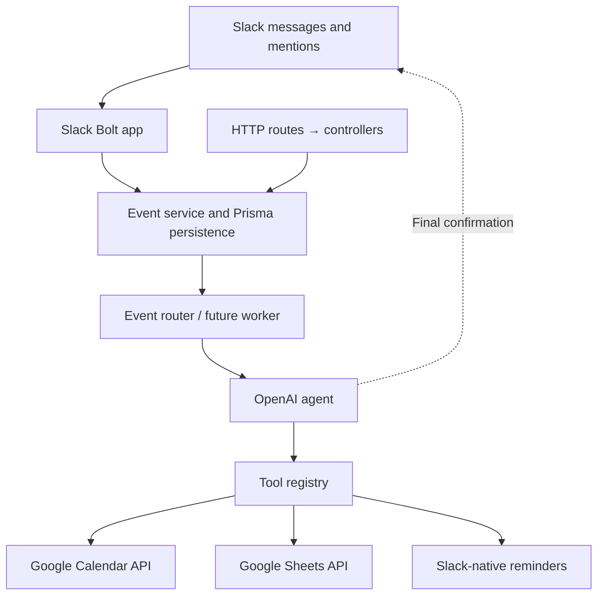

# Arias

Node.js + TypeScript service scaffold for Slack event handling and routing through OpenAI to Google Calendar, Google Sheets, and Slack-native reminders.

**Current scope: project skeleton.** The HTTP server, Zod validation, Prisma persistence, event creation/lookup, and Docker setup work. Slack listeners, background event processing, OpenAI tool calling, external API operations, and Slack confirmations are extension points to implement together. Creating an event stores it as `PENDING`; it does not execute an integration.

## Intended architecture



Fastify handles HTTP. Prisma uses SQLite so local development and Docker need no separate database server. This is a single-instance starting point; changing to PostgreSQL later requires a Prisma provider/adapter change and new migrations.

## Run with Docker Compose

Requires Docker with the Compose plugin.

```bash
cp .env.example .env
openssl rand -hex 32
```

Put the generated value in `API_KEY` in `.env`. The example value is intentionally rejected. External provider credentials can stay empty while developing the skeleton.

```bash
docker compose up --build -d
docker compose logs -f app
```

The container applies the committed Prisma migrations before starting. The API runs at `http://localhost:3000`; SQLite data lives in the `arias-data` named volume. `PORT` in `.env` can change the host port. Compose binds the API to localhost.

```bash
curl http://localhost:3000/health
docker compose down
```

`docker compose down` preserves the database. `docker compose down -v` deletes it. After code changes, rerun `docker compose up --build -d` to rebuild the image.

## Deploy to DigitalOcean

The initial deployment target is a **single DigitalOcean Droplet running Docker Compose**. Create an Ubuntu Droplet using the Docker Marketplace image and add your SSH key. DigitalOcean documents the image and SSH options in its [Droplet creation guide](https://docs.digitalocean.com/products/droplets/how-to/create/).

SSH into the Droplet, then clone this project after pushing it to your repository:

```bash
ssh root@YOUR_DROPLET_IP
git clone YOUR_REPOSITORY_URL /opt/arias
cd /opt/arias
cp .env.example .env
chmod 600 .env
openssl rand -hex 32
nano .env
```

Set `API_KEY` to the generated secret. Reserve `OPENAI_API_KEY` and `OPENAI_MODEL` for the agent implementation; Slack and Google credentials can also remain empty for now. Never commit `.env`.

```bash
docker compose up --build -d
docker compose ps
docker compose logs --tail=100 app
curl http://127.0.0.1:3000/health
```

Compose restarts the service after a reboot and retains SQLite data in its named volume. Keep the same project directory when redeploying so Compose uses the same volume. Set up backups of the database; a named volume persists across container replacement but is not an off-server backup.

The HTTP API stays bound to the Droplet's loopback interface. For development access, open an SSH tunnel from your laptop:

```bash
ssh -L 3001:127.0.0.1:3000 root@YOUR_DROPLET_IP
# In another local terminal:
curl http://localhost:3001/health
```

A public HTTP endpoint/domain and HTTPS reverse proxy are not part of this skeleton. The planned Slack Socket Mode connection will be started from the backend when its listeners are implemented.

To deploy code updates from the project directory on the Droplet:

```bash
git pull --ff-only
docker compose up --build -d
docker compose logs --tail=100 app
```

This SQLite setup targets a Droplet. If we choose DigitalOcean App Platform or multiple instances later, move persistence to a managed database first: App Platform's local filesystem is ephemeral. See [App Platform data storage](https://docs.digitalocean.com/products/app-platform/how-to/store-data/).

## Run locally

Requires Node.js 24+ and npm. If `better-sqlite3` needs to compile on your platform, install Python, Make, and a C++ compiler.

```bash
cp .env.example .env
# Set API_KEY in .env to a random value of at least 24 characters.
npm ci
npm run db:generate
npm run db:deploy
npm run dev
```

The default local database is `prisma/dev.db`. Local development and Docker use separate databases. Provider credentials are not needed to start the HTTP server.

```bash
npm run typecheck
npm run build
npm start
```

After editing `prisma/schema.prisma`, generate a migration locally and commit the resulting files:

```bash
npm run db:migrate -- --name describe_your_change
npm run db:generate
```

Use `npm run db:studio` to inspect data. The Docker startup command uses `db:deploy`, which applies existing migrations without generating new ones.

If Prisma returns a blank `Schema engine error` while creating SQLite and your shell has `RUST_LOG=warn`, run `unset RUST_LOG` and retry. This was observed in the development tool environment; default logging allowed the fresh migration to complete.

## HTTP endpoints

| Method | Path | Purpose |
| --- | --- | --- |
| GET | `/health` | Server/database health; no authentication |
| POST | `/api/events` | Validate and persist an event; returns `201` |
| GET | `/api/events/:id` | Read the persisted event and status |

All `/api` routes require `Authorization: Bearer <API_KEY>`. An optional `idempotencyKey` must be unique; a duplicate returns `409`. Invalid input returns `400`; unknown event IDs return `404`.

```bash
export ARIAS_API_KEY='the-value-you-set-in-dot-env'

curl -X POST http://localhost:3000/api/events \
  -H "Authorization: Bearer $ARIAS_API_KEY" \
  -H 'Content-Type: application/json' \
  -d '{
    "type": "agent.request",
    "source": "api",
    "payload": {"text": "Schedule a meeting tomorrow"},
    "idempotencyKey": "example-event-1"
  }'

curl http://localhost:3000/api/events/REPLACE_WITH_RETURNED_ID \
  -H "Authorization: Bearer $ARIAS_API_KEY"
```

These endpoints store/read events only. There is no worker yet to move events out of `PENDING`.

## Project layout

```text
src/
  index.ts                   # Startup and graceful shutdown
  app.ts                     # HTTP app and dependency wiring
  config.ts                  # Zod environment validation
  db.ts                      # Prisma client
  errors.ts                  # Application errors
  routes/                    # HTTP endpoint registration
  controllers/               # Request validation and responses
  services/                  # Event application logic
  repositories/              # Prisma database access
  validators/                # Zod request schemas and inferred types
  middleware/                # API authentication and error handling
  events/                    # Event dispatch registry; not wired to a worker
  agent/                     # OpenAI client factory and service placeholder
  tools/                     # Shared tool interface and registry
  integrations/
    slack/                   # Bolt Socket Mode factory; not started yet
    google/                  # Shared Google OAuth client factory
    calendar/                # Calendar input schema and service placeholder
    sheets/                  # Sheets input schema and service placeholder
    reminders/               # Slack reminder schema and service placeholder
  generated/prisma/          # Generated Prisma client; ignored by Git
prisma/
  schema.prisma              # Event and ToolCall models
  migrations/                # Committed database migrations
Dockerfile
compose.yaml
```

`Event` holds incoming payloads and processing status. `ToolCall` is the audit model for future agent tool execution; the skeleton does not populate it yet. Reminder delivery will use Slack rather than a separate local reminder scheduler.

## Integration configuration and next steps

1. **Slack/Bolt:** configure `SLACK_BOT_TOKEN` and `SLACK_APP_TOKEN`, implement mention/direct-message listeners in `slack.app.ts`, and connect them to the event service. The planned transport is Socket Mode. Start/stop Bolt alongside the HTTP server once listeners are ready. Add reply handling for confirmations.
2. **Event routing:** register handlers in `EventRouter`; implement a worker and status transitions, retries, and deduplication before dispatching persisted events.
3. **OpenAI:** set `OPENAI_API_KEY` and `OPENAI_MODEL`. Implement the Responses API function-calling loop in `OpenAIService`, using the tool registry and recording results in `ToolCall`.
4. **Google:** enable Calendar and Sheets APIs, configure OAuth credentials and a refresh token in `.env`, then implement the Calendar/Sheets services. The intended scopes are `calendar.events` and `spreadsheets` on the Google API scope URL. The OAuth consent/token acquisition flow is not included.
5. **Reminders:** implement the selected Slack-native reminder API and its required scopes/token type. `SLACK_USER_TOKEN` is reserved for methods requiring a user token; this app does not use it yet.

To add a tool, create its integration service and Zod schema, then register an `AgentTool` in `src/tools/tool.registry.ts`. Add a Prisma model only if that integration needs local persistence. Placeholder service methods deliberately throw `501` errors so they cannot report fake success.

This scaffold uses one shared API key and one configured set of provider credentials. Workspace/user authorization and per-user OAuth storage are future application work.

The current npm install reports four high-severity dependency advisories in Prisma's dependency tree, including `mysql2` and `deepmerge-ts`. Review compatible upstream fixes before production deployment; no forced dependency overrides have been applied.

## Reference documentation

- [Prisma SQLite configuration](https://www.prisma.io/docs/orm/overview/databases/sqlite)
- [OpenAI tool use](https://developers.openai.com/api/docs/guides/function-calling)
- [Google Calendar events.insert](https://developers.google.com/workspace/calendar/api/v3/reference/events/insert)
- [Google Sheets values.append](https://developers.google.com/workspace/sheets/api/reference/rest/v4/spreadsheets.values/append)
