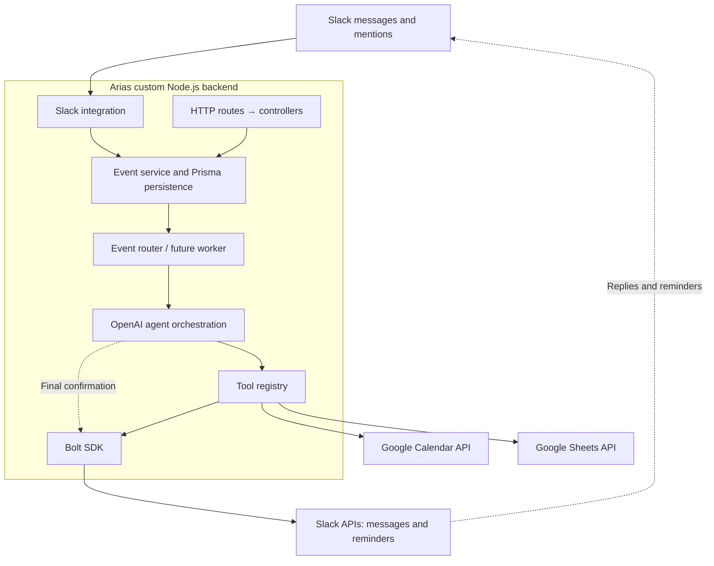

# Arias

Arias is our custom Node.js + TypeScript backend for event handling and routing through OpenAI to Google Calendar, Google Sheets, and Slack-native reminders. The backend uses the Bolt SDK to call Slack APIs.

**Current scope: project skeleton.** The HTTP server, Zod validation, Prisma persistence, event creation/lookup, and Docker setup work. Slack listeners, background event processing, OpenAI tool calling, external API operations, and Slack confirmations are extension points to implement together. Creating an event stores it as `PENDING`; it does not execute an integration.

## Intended architecture



Arias owns the routes, controllers, services, event routing, persistence, and agent orchestration. Fastify handles HTTP. Our backend uses the Bolt SDK as its client for Slack API calls, including posting confirmations and interacting with Slack reminders. Prisma uses PostgreSQL through the `@prisma/adapter-pg` driver adapter.

## Run with Docker Compose

Requires Docker with the Compose plugin.

```bash
cp .env.example .env
openssl rand -hex 32
```

Put the generated value in `API_KEY` in `.env` and set `DATABASE_URL` to a reachable PostgreSQL database. The example values are intentionally unusable. External provider credentials can stay empty while developing the skeleton.

```bash
docker compose up --build -d
docker compose logs -f app
```

The container applies the committed Prisma migrations to PostgreSQL before starting. The API runs at `http://localhost:3000`. `PORT` in `.env` can change the host port. Compose binds the API to localhost.

```bash
curl http://localhost:3000/health
docker compose down
```

`docker compose down` does not affect the external database. After code changes, rerun `docker compose up --build -d` to rebuild the image.

## Step by step: upload to Docker Hub and deploy to DigitalOcean

Our first cloud target is **DigitalOcean App Platform**, using an image pushed to **Docker Hub**. `compose.yaml` remains useful locally; App Platform runs the container image with its own service settings.

Follow the steps in order: prepare → build → test → log in → tag → upload → deploy. Steps 1–6 upload the image to Docker Hub. Steps 7–9 run that uploaded image on DigitalOcean App Platform.

The image requires an external PostgreSQL database. Configure `DATABASE_URL` as an encrypted App Platform runtime variable and allow the service to connect to the database before deploying.

### 1. Prepare Docker and your Docker Hub repository

Start Docker on your computer and open a terminal in the project root, where `Dockerfile` and `package.json` are located. Check that Docker is available:

```bash
docker --version
docker info
```

Sign in to Docker Hub, create a repository named `arias`, and choose whether it is public or private. In the commands below, replace `YOUR_DOCKERHUB_USERNAME` with your Docker Hub username, or the organization namespace that owns the repository.

The existing multi-stage `Dockerfile`:

- Installs dependencies from `package-lock.json`, generates Prisma Client, and compiles TypeScript.
- Copies the compiled app, production dependencies, and migrations into the runtime image.
- Runs as the `node` user, listens on `0.0.0.0:3000`, and applies migrations before starting the server.

`.dockerignore` excludes `.env` and local databases. Set credentials at runtime; do not add them to the Dockerfile or build arguments. The runtime includes the Prisma CLI because the startup command applies migrations.

### 2. Build the Docker image

Run from the project root with Docker running:

```bash
docker build --platform linux/amd64 -t arias:deploy-001 .
```

Wait for the build to finish successfully. `arias` is the local image name and `deploy-001` is its version tag. The final `.` tells Docker to build from this project directory.

### 3. Test the image locally

Use the existing `.env` with a valid `API_KEY`. For a fresh checkout, copy `.env.example` and replace its placeholder API key first.

```bash
docker run --rm -d --name arias-check \
  --env-file .env \
  -e HOST=0.0.0.0 -e PORT=3000 \
  -p 127.0.0.1:3001:3000 \
  arias:deploy-001

docker logs -f arias-check
```

Once the server is listening, use another terminal:

```bash
curl --fail http://localhost:3001/health
docker stop arias-check
```

Expected response: `{"status":"ok","service":"arias"}`. This test container is removed when stopped, including its temporary database.

### 4. Log in to Docker Hub

Authenticate Docker with your Docker Hub account and follow the login prompts:

```bash
docker login
```

### 5. Tag the image for your Docker Hub repository

```bash
docker tag arias:deploy-001 YOUR_DOCKERHUB_USERNAME/arias:deploy-001
```

This gives the local image the repository name Docker Hub expects. It does not upload the image yet.

### 6. Upload the image to Docker Hub

```bash
docker push YOUR_DOCKERHUB_USERNAME/arias:deploy-001
```

Wait for the push to finish, then open your `arias` repository on Docker Hub and check that `deploy-001` appears in its tags. The upload is complete when that image version is available. Docker Hub stores the image; DigitalOcean App Platform runs it.

### 7. Select the Docker Hub image in App Platform

In DigitalOcean, open **Apps → Create App → Container image**, choose **Docker Hub**, and enter repository `YOUR_DOCKERHUB_USERNAME/arias`, tag `deploy-001`. For a private repository, provide Docker Hub credentials in the registry credentials field using `username:token`; use a token with read access. Public repositories do not require pull credentials. Configure the component as a **Web Service**:

| Setting | Value |
| --- | --- |
| HTTP port | `3000` |
| Route | `/` |
| Instance count | `1` for the initial check |
| Health check | HTTP, path `/health` |
| Run command | Leave blank to retain the Dockerfile startup command |

### 8. Set runtime environment variables

Add these runtime environment variables:

| Variable | Value |
| --- | --- |
| `NODE_ENV` | `production` |
| `HOST` | `0.0.0.0` |
| `PORT` | `3000` |
| `API_KEY` | A random secret of at least 24 characters; mark encrypted |
| `DATABASE_URL` | PostgreSQL connection URL; mark encrypted |

Generate an API key with `openssl rand -hex 32` and paste it into the encrypted variable field. OpenAI, Slack, and Google credentials are optional while their integrations remain placeholders. App Platform does not receive your local `.env` from the image.

### 9. Deploy and verify

Review the resources and price shown, then deploy. Once the deployment completes, copy the HTTPS URL from App Platform and check the runtime logs. Verify the service from your terminal, replacing `YOUR_APP_HOSTNAME` with the hostname DigitalOcean provides:

```bash
curl --fail https://YOUR_APP_HOSTNAME/health
```

Expected response: `{"status":"ok","service":"arias"}`. Follow DigitalOcean's [container image deployment guide](https://docs.digitalocean.com/products/app-platform/how-to/deploy-from-container-images/) for the current dashboard flow.

A successful health response verifies server startup and database connectivity. Slack listeners and agent execution are still pending; health does not verify those integrations.

### 10. Upload and deploy the next version

After changing the code, build and upload a new version:

```bash
docker build --platform linux/amd64 -t arias:deploy-002 .
docker tag arias:deploy-002 YOUR_DOCKERHUB_USERNAME/arias:deploy-002
docker push YOUR_DOCKERHUB_USERNAME/arias:deploy-002
```

Then select tag `deploy-002` in the App Platform component and redeploy. App Platform does not automatically redeploy on Docker Hub pushes; trigger deployment after updating the selected tag. See [Docker Hub deployment support](https://docs.digitalocean.com/products/app-platform/how-to/deploy-from-container-images/).

Before retaining real data, test migrations, backups, and persistence across deployments as described in [TASKS.md](TASKS.md).

## Run locally

Requires Node.js 24+, npm, and access to PostgreSQL.

```bash
cp .env.example .env
# Set API_KEY and DATABASE_URL in .env.
npm ci
npm run db:generate
npm run db:deploy
npm run dev
```

Local development and Docker use the PostgreSQL database configured by `DATABASE_URL`. Other provider credentials are not needed to start the HTTP server.

```bash
npm run typecheck
npm run build
npm start
```

After editing `prisma/schema.prisma`, generate a migration locally and commit the resulting files:

```bash
npm run db:migrate -- --name describe_your_change
npm run db:generate
```

Use `npm run db:studio` to inspect data. The Docker startup command uses `db:deploy`, which applies existing migrations without generating new ones.

## HTTP endpoints

| Method | Path | Purpose |
| --- | --- | --- |
| GET | `/health` | Server/database health; no authentication |
| POST | `/api/events` | Validate and persist an event; returns `201` |
| GET | `/api/events/:id` | Read the persisted event and status |

All `/api` routes require `Authorization: Bearer <API_KEY>`. An optional `idempotencyKey` must be unique; a duplicate returns `409`. Invalid input returns `400`; unknown event IDs return `404`.

```bash
export ARIAS_API_KEY='the-value-you-set-in-dot-env'

curl -X POST http://localhost:3000/api/events \
  -H "Authorization: Bearer $ARIAS_API_KEY" \
  -H 'Content-Type: application/json' \
  -d '{
    "type": "agent.request",
    "source": "api",
    "payload": {"text": "Schedule a meeting tomorrow"},
    "idempotencyKey": "example-event-1"
  }'

curl http://localhost:3000/api/events/REPLACE_WITH_RETURNED_ID \
  -H "Authorization: Bearer $ARIAS_API_KEY"
```

These endpoints store/read events only. There is no worker yet to move events out of `PENDING`.

## Project layout

```text
src/
  index.ts                   # Startup and graceful shutdown
  app.ts                     # HTTP app and dependency wiring
  config.ts                  # Zod environment validation
  db.ts                      # Prisma client
  errors.ts                  # Application errors
  routes/                    # HTTP endpoint registration
  controllers/               # Request validation and responses
  services/                  # Event application logic
  repositories/              # Prisma database access
  validators/                # Zod request schemas and inferred types
  middleware/                # API authentication and error handling
  events/                    # Event dispatch registry; not wired to a worker
  agent/                     # OpenAI client factory and service placeholder
  tools/                     # Shared tool interface and registry
  integrations/
    slack/                   # Bolt SDK integration for Slack API calls
    google/                  # Shared Google OAuth client factory
    calendar/                # Calendar input schema and service placeholder
    sheets/                  # Sheets input schema and service placeholder
    reminders/               # Slack reminder schema and service placeholder
  generated/prisma/          # Generated Prisma client; ignored by Git
prisma/
  schema.prisma              # Event and ToolCall models
  migrations/                # Committed database migrations
Dockerfile
compose.yaml
```

`Event` holds incoming payloads and processing status. `ToolCall` is the audit model for future agent tool execution; the skeleton does not populate it yet. Reminder delivery will use Slack rather than a separate local reminder scheduler.

## Integration configuration and next steps

The implementation checklist is in [TASKS.md](TASKS.md). Each tool action has its own task, inputs, dependencies, and completion criteria. We will start with the shared executor and the Sheets append tool, then connect OpenAI and Slack.

1. **Slack integration:** use the Bolt SDK inside Arias to call Slack APIs. Configure the tokens and scopes required by each operation, then implement sending messages, posting confirmations, and reminder API calls. Connect incoming Slack events to Arias's event service as a separate part of the integration. The existing `slack.app.ts` factory is a placeholder for this work.
2. **Event routing:** register handlers in `EventRouter`; implement a worker and status transitions, retries, and deduplication before dispatching persisted events.
3. **OpenAI:** set `OPENAI_API_KEY` and `OPENAI_MODEL`. Implement the Responses API function-calling loop in `OpenAIService`, using the tool registry and recording results in `ToolCall`.
4. **Google:** enable Calendar and Sheets APIs, configure OAuth credentials and a refresh token in `.env`, then implement the Calendar/Sheets services. The intended scopes are `calendar.events` and `spreadsheets` on the Google API scope URL. The OAuth consent/token acquisition flow is not included.
5. **Reminders:** implement the selected Slack-native reminder API and its required scopes/token type. `SLACK_USER_TOKEN` is reserved for methods requiring a user token; this app does not use it yet.

To add a tool, create its integration service and Zod schema, then register an `AgentTool` in `src/tools/tool.registry.ts`. Add a Prisma model only if that integration needs local persistence. Placeholder service methods deliberately throw `501` errors so they cannot report fake success.

This scaffold uses one shared API key and one configured set of provider credentials. Workspace/user authorization and per-user OAuth storage are future application work.

The current npm install reports four high-severity dependency advisories in Prisma's dependency tree, including `mysql2` and `deepmerge-ts`. Review compatible upstream fixes before production deployment; no forced dependency overrides have been applied.

## Reference documentation

- [Prisma PostgreSQL configuration](https://www.prisma.io/docs/orm/overview/databases/postgresql)
- [OpenAI tool use](https://developers.openai.com/api/docs/guides/function-calling)
- [Google Calendar events.insert](https://developers.google.com/workspace/calendar/api/v3/reference/events/insert)
- [Google Sheets values.append](https://developers.google.com/workspace/sheets/api/reference/rest/v4/spreadsheets.values/append)
